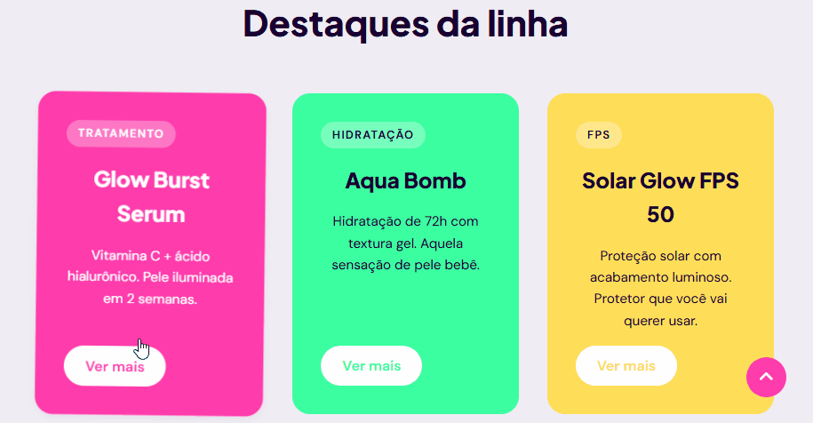
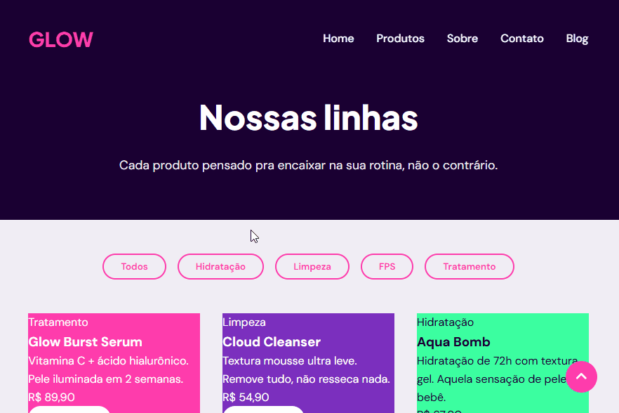
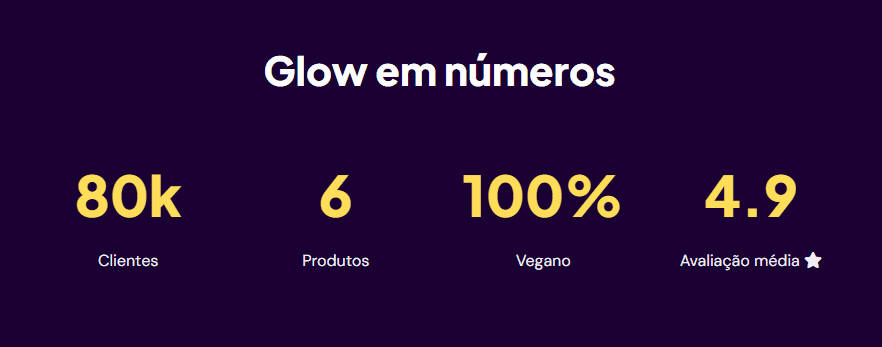

# 🌟 Glow Republic

Site fictício de uma marca brasileira de skincare vegano, jovem e vibrante. Desenvolvido do zero em **HTML, CSS e JavaScript puro**, sem frameworks ou bibliotecas de front-end.

> Projeto pessoal de estudo, construído como prática de fundamentos de front-end: estruturação semântica de múltiplas páginas, estilização com variáveis CSS, manipulação do DOM e interatividade com JavaScript.









---

## 🔗 Demo

https://nathaliadebona.github.io/glow-republic/
`[link do site publicado]`

---

## 📋 Sobre o projeto

A Glow Republic é uma marca de skincare vegano com identidade visual bold e colorida, focada no público jovem. O site apresenta a marca, seus produtos, história e canais de contato — simulando um e-commerce de beleza real.

O site é composto por 8 páginas interligadas: Home, Produtos, Sobre, Contato, Blog e 3 páginas de posts individuais.

---

## ✨ Funcionalidades

- 🍔 **Hamburger menu** — menu mobile com abertura e fechamento via toggle de classe
- 🌑 **Navbar com efeito scroll** — fundo transparente que ganha cor ao rolar a página
- 🛍️ **Modal de produtos** — abertura e fechamento de modal com informações detalhadas de cada produto, incluindo fechar ao clicar no overlay
- 🔍 **Filtro de produtos** — filtragem por categoria com animação de fade e destaque visual no botão ativo
- ✅ **Validação de formulário** — validação customizada em tempo real com mensagens de erro por campo e exibição de mensagem de sucesso
- 📧 **Newsletter** — validação de e-mail com feedback visual de sucesso ou erro
- 🔢 **Contador animado** — números que sobem até o valor final quando a seção entra na viewport, usando `IntersectionObserver`
- 🏷️ **Tag flutuante animada** — animação contínua de flutuação com `@keyframes`
- 🔝 **Botão voltar ao topo** — âncora fixa na tela
- 📱 **Design responsivo** — adaptado para desktop, tablet e celular

---

## 🛠️ Tecnologias

- **HTML5** — marcação semântica com múltiplas páginas interligadas
- **CSS3** — variáveis CSS, Grid, Flexbox, media queries, transições, animações com `@keyframes`
- **JavaScript (Vanilla)** — manipulação do DOM, eventos, `IntersectionObserver`, `dataset`, `setInterval`
- **Font Awesome** — ícones via CDN
- **Google Fonts** — tipografia (Plus Jakarta Sans, DM Sans)

---

## 📁 Estrutura do projeto

```
glow-republic/
├── index.html          # Home
├── products.html       # Página de produtos com filtro e modais
├── about.html          # Sobre a marca
├── contact.html        # Formulário de contato
├── blog.html           # Listagem de posts
├── posts/
│   ├── rotina-skincare.html
│   ├── o-que-e-retinol.html
│   └── fps-mitos.html
├── style.css           # Estilos globais (reset, variáveis, navbar, footer)
├── home.css            # Estilos da home
├── products.css        # Estilos da página de produtos
├── about.css           # Estilos da página sobre
├── contact.css         # Estilos da página de contato
├── blog.css            # Estilos da listagem do blog
├── post.css            # Estilos dos posts individuais
├── script.js           # Toda a lógica JavaScript
└── imagens/            # Imagens do site
```

---

## 🎨 Paleta de cores e tipografia

| Uso | Cor |
|---|---|
| Fundo escuro / navbar | `#1A0033` |
| Rosa vibrante (destaque) | `#FF3CAC` |
| Amarelo elétrico | `#FFDE59` |
| Verde menta | `#3CFFA0` |
| Fundo claro | `#F0EDF5` |
| Texto secundário | `#555555` |

**Tipografia:** [Plus Jakarta Sans](https://fonts.google.com/specimen/Plus+Jakarta+Sans) (títulos), [DM Sans](https://fonts.google.com/specimen/DM+Sans) (corpo e UI)

---

## 🧠 Aprendizados

Este projeto foi construído em etapas, como prática progressiva de front-end:

- **Estrutura multi-página** — organização de um projeto com 8 páginas interligadas, incluindo subpasta para posts do blog com caminhos relativos (`../`) corretamente configurados
- **CSS por página** — separação de estilos globais e específicos por página, evitando conflitos de especificidade
- **Grid e Flexbox** — uso combinado para layouts de grids de produtos, seções em duas colunas e navbar
- **Variáveis CSS** — sistema de design consistente com cores e fontes centralizadas no `:root`
- **Media queries** — responsividade com breakpoints em `768px` e `480px`
- **nth-child** — aplicação de cores diferentes por card sem necessidade de classes adicionais
- **dataset** — uso de atributos `data-*` para conectar botões aos modais e filtros às categorias de produto
- **IntersectionObserver** — detecção de elemento na viewport para animação de contadores
- **setInterval / clearInterval** — animação de contagem numérica progressiva
- **Validação customizada** — formulário com validação de nome completo, e-mail com posição do `@`, select obrigatório e tamanho mínimo de mensagem
- **Guard `if (elemento)`** — proteção contra erros de `null` em elementos que não existem em todas as páginas
- **Depuração com DevTools** — uso do inspetor para identificar conflitos de especificidade, elementos colapsados e fontes não carregadas

---

## 🚀 Como rodar o projeto

Não há dependências ou build — é só HTML, CSS e JS puro.

```bash
# Clone o repositório
git clone https://github.com/nathaliadebona/glow-republic.git

# Entre na pasta
cd glow-republic

# Abra o index.html no navegador
```

Ou use a extensão **Live Server** do VS Code para rodar com recarregamento automático.

---

## 👩‍💻 Autoria

Desenvolvido por **Nathália** como projeto de estudo em front-end.

Github https://github.com/nathaliadebona
Portfólio https://nathaliadebona.github.io/portfolio/

---

## 📄 Licença

Este é um projeto de estudo, livre para consulta e aprendizado.

